## 목표

- **1차 목표**: 실시간 자동매매에 바로 연결 가능한 수준의 **리스크 관리 + 포지션/주문/실행 엔진**을 구축하고, 기존 연구용 모듈들과 일관된 파이프라인으로 통합.
- **제약**: 아직 특정 브로커/거래소가 정해지지 않았으므로, **브로커 추상화 레이어**를 두고 실제 API 연동은 어댑터 형태로 분리.

## 전체 아키텍처 개요

- **전략/알파 계층**: 기존 `StrategyFactory`, `AlphaDiscoveryModel` 유지·보강
- **위험/포트폴리오 계층**: `RiskGovernor`, `PortfolioManager`를 실전 규칙/제약 반영 가능하게 확장
- **주문/실행 계층**: `ExecutionOptimizer`를 주문 라우팅/슬리피지/체결 시뮬레이션/브로커 추상화까지 포함하는 모듈로 확장
- **실행 엔진**: `AutonomousHedgeFund`를 **실시간 루프 + 상태 관리 + 리스크 체크 + 주문 실행**까지 담당하는 메인 엔진으로 고도화
- **공통 인프라**: 설정, 로깅, 예외 처리, 백테스트/실전 모드 스위치 등을 추가

간단한 데이터/제어 흐름:

```mermaid
flowchart LR
  marketData[MarketDataFeed] --> strategyEngine[StrategyFactory/AlphaModel]
  strategyEngine --> candidateStrats[CandidateStrategies]
  candidateStrats --> portfolioEngine[PortfolioManager]
  portfolioEngine --> riskGovernor[RiskGovernor]
  riskGovernor --> approvedOrders[ApprovedOrders]
  approvedOrders --> executionEngine[ExecutionEngine]
  executionEngine --> brokerAdapter[BrokerAdapter]
```

## 세부 계획

### 1. 설정/환경 분리 및 공통 유틸

- **구성**
  - `config/` 디렉토리를 추가해 `config/trading.yaml` 또는 `config/trading.json` 형태의 설정 파일 도입.
  - 환경(연구/실전)을 나타내는 `mode` (e.g. `backtest`, `paper`, `live`) 플래그 정의.
  - 공통 로깅/예외 처리 유틸을 위한 `core/` 디렉토리 도입(`core/logging_utils.py`, `core/exceptions.py`, `core/config.py`).
- **기능**
  - 로그 레벨/로그 파일 경로, 리스크 파라미터, 기본 브로커 타입, 심볼 리스트 등을 설정 파일로 관리.
  - 간단한 구조화 로그(JSON 또는 키-값) 출력 지원.

### 2. RiskGovernor 고도화

- **현재 코드**: [risk_governor/risk_governor.py](risk_governor/risk_governor.py)
- **개선 방향**
  - **추가 메트릭**: 현재 `max_drawdown`, `position_limit` 외에 다음 메서드 추가
    - 일일 손실 한도(Daily loss limit), 종목별/전략별 최대 익스포저, 레버리지 한도 등.
    - VaR(간단한 히스토리컬/파라메트릭), 볼래틸리티 기반 포지션 사이징.
  - **리스크 체크 인터페이스**
    - `validate_orders(portfolio_state, candidate_orders) -> approved_orders, violations` 형태의 메서드 추가.
    - 리스크 위반 시 이유 코드를 반환해 로깅/모니터링 가능하게 설계.
  - **실전 모드 대응**
    - 계좌 순자산/미실현손익/오픈 포지션 정보는 나중에 브로커 어댑터에서 가져오도록 인터페이스만 정의.

### 3. PortfolioManager 고도화

- **현재 코드**: [portfolio/portfolio_manager.py](portfolio/portfolio_manager.py)
- **개선 방향**
  - **목표**: 실전에서 쓸 수 있는 최소한의 포트폴리오 로직(리스크 균형, 기본 규칙 기반).
  - 기능 추가:
    - 기대 수익/위험(예: 샤프비, 변동성 추정)을 입력 받아, **리스크 균형형(예: 위험 패리티 근사)** 가중치 산출 옵션.
    - 전략/자산군/섹터별 **최대/최소 비중 제약** 지원.
    - `mode`에 따라:
      - `backtest`/`paper`: 내부 시뮬레이션 상태에서 포지션 사이즈 계산.
      - `live`: 브로커에서 실시간 계좌 정보를 받아 총 익스포저를 고려하여 조정할 수 있게 인터페이스 정의.

### 4. ExecutionOptimizer → 주문/실행 엔진으로 확장

- **현재 코드**: [execution_optimizer/execution_optimizer.py](execution_optimizer/execution_optimizer.py)
- **개선 방향**
  - **주문 모델 정의**
    - 공통 주문 데이터 클래스(예: `Order` with symbol, side, quantity, order_type, time_in_force, price 등) 추가.
    - 체결 결과(예: `ExecutionReport`) 데이터 구조 정의.
  - **실행 전략**
    - 단순 시장가/지정가 외에, 최소한의 슬리피지/체결 실패 시뮬레이션 로직을 `backtest`/`paper` 모드에서 제공.
    - 체결 실패/부분 체결 시 재시도 로직(간단한 재시도/취소 정책).
  - **브로커 추상화 레이어**
    - `brokers/base.py`에 `BaseBroker` 추상 클래스 정의: `get_positions()`, `get_balance()`, `place_order()`, `cancel_order()`, `get_open_orders()` 등.
    - `ExecutionOptimizer`는 브로커 인스턴스를 주입 받아(`BaseBroker` 인터페이스) 모드에 따라 다른 구현 사용:
      - `PaperBroker`: in-memory 체결 시뮬레이터.
      - 이후 필요 시 `BinanceBroker`, `IBBroker`, `KoreanBroker` 등 어댑터 추가.

### 5. AutonomousHedgeFund 엔진 고도화

- **현재 코드**: [autonomous_hedge_fund/engine.py](autonomous_hedge_fund/engine.py)
- **개선 방향**
  - **실시간 루프 구조**
    - `run_live()` 메서드를 추가해 다음 단계를 주기적으로 수행:
      1. 마켓데이터(실시간 혹은 폴링 방식) 입력 수집.
      2. `StrategyFactory` 및 `AlphaDiscoveryModel`을 통해 전략/시그널 생성.
      3. `PortfolioManager`로 포지션/비중 계산.
      4. `RiskGovernor`로 리스크 검증.
      5. 승인된 주문만 `ExecutionOptimizer`에 전달, 브로커로 전송.
      6. 결과/리스크 상태/포지션 요약을 로깅.
  - **상태 관리**
    - 현재 포트폴리오, 오픈 포지션, 당일 PnL, 리스크 지표를 구조체(or dataclass)로 관리.
    - 백테스트/실전 모드 모두 동일한 엔진 로직을 사용하되, 데이터 소스와 브로커 구현만 교체.
  - **중단/재시작 안전성**
    - 최소한의 체크포인트(최근 포지션/리스크 상태)를 파일로 저장하는 옵션을 제공해 재시작 시 참고 가능.

### 6. Data/Backtest 계층 정리 및 성능 개선

- **현재 GPU 백테스트**: [distributed_gpu_backtest/gpu_cluster.py](distributed_gpu_backtest/gpu_cluster.py)
- **개선 방향**
  - **데이터 구조 표준화**
    - 전략 평가/백테스트 시 사용하는 입력 포맷(예: pandas DataFrame or numpy array)을 명확히 통일.
  - **성능 및 안전성**
    - `ray.init()` 설정을 구성 파일에서 제어(로컬/멀티 노드, GPU 개수 등).
    - 샤프비 계산 시 분모 0 방지, NaN 처리.
    - 큰 전략 배치 실행 시 진행률 로깅 및 기본적인 타임아웃/예외 처리.

### 7. GlobalLiquidityScanner 및 스크립트 보강

- **현재 코드**: [global_liquidity_scanner/liquidity_scanner.py](global_liquidity_scanner/liquidity_scanner.py), [scripts/run_liquidity_scan.py](scripts/run_liquidity_scan.py)
- **개선 방향**
  - 네트워크 오류, 종목 코드 오류, 데이터 없음 등의 예외 처리 추가.
  - 단순 print 출력 대신, 결과를 구조화된 형태로 리턴하고 로깅/파일 저장(예: CSV/JSON) 옵션 제공.
  - 이 모듈을 **사전 유동성 필터링 단계**로 엔진에 통합할 수 있도록 인터페이스 정리.

### 8. 테스트/검증 및 데모 파이프라인

- **통합 데모 스크립트**
  - 예: `scripts/demo_paper_trading.py`를 만들어, `paper` 모드에서 전체 파이프라인(전략→리스크→포지션→주문→체결 시뮬레이션)을 한 번에 실행.
- **단위 테스트 (선택적 1차 범위)**
  - `RiskGovernor`, `PortfolioManager`, `ExecutionOptimizer`의 핵심 메서드에 대해 간단한 테스트(`pytest` 기준) 추가.
- **문서화**
  - `README.md`에 모드별 사용법(백테스트/페이퍼/라이브), 필수 설정, 데모 스크립트 실행 방법을 간략히 추가.

